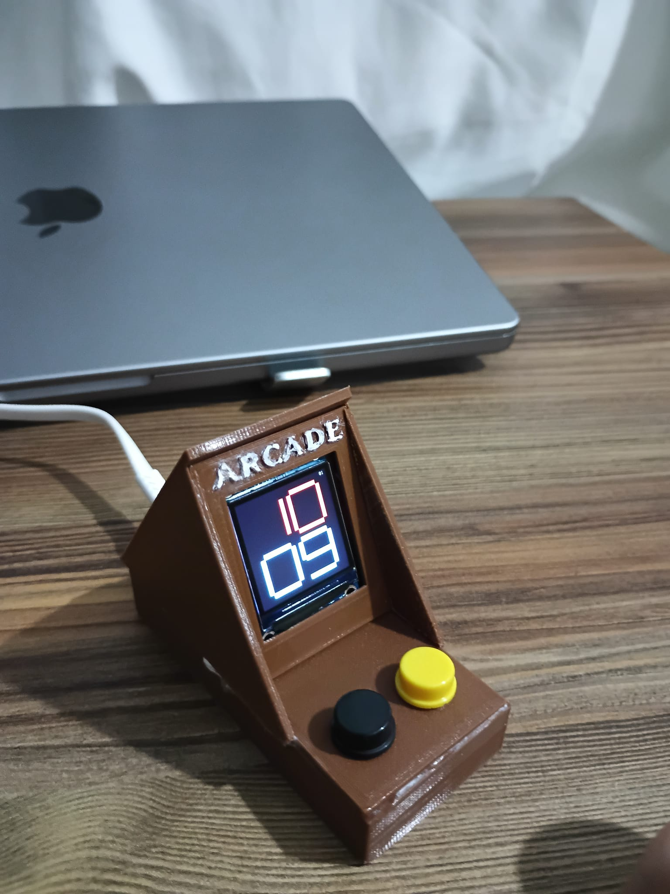
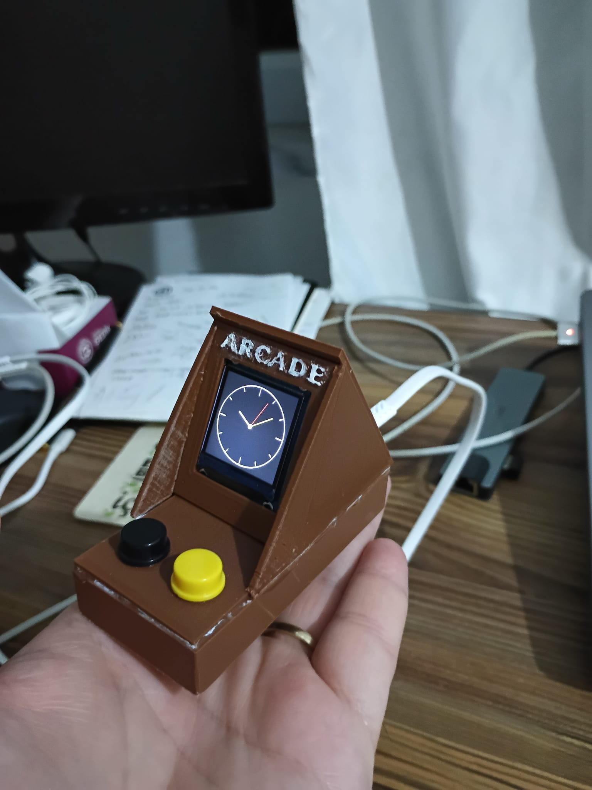
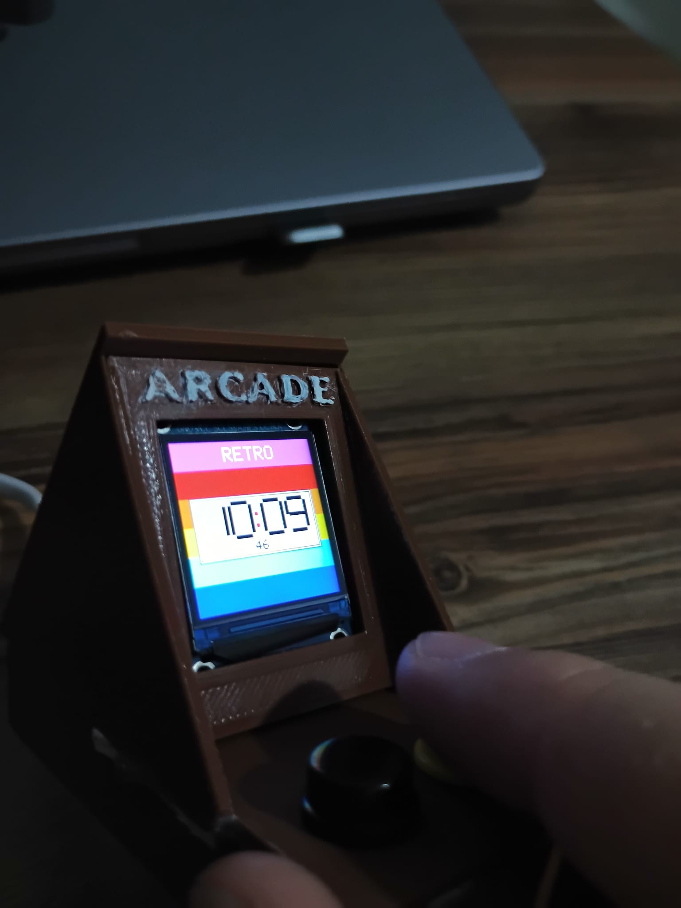
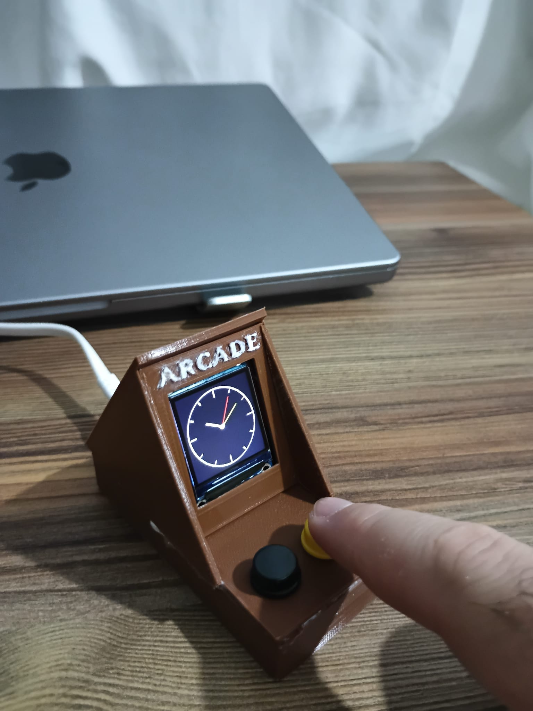
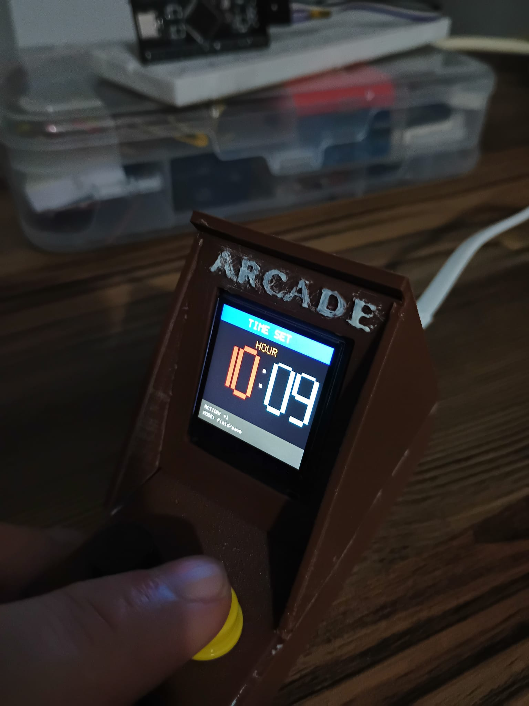
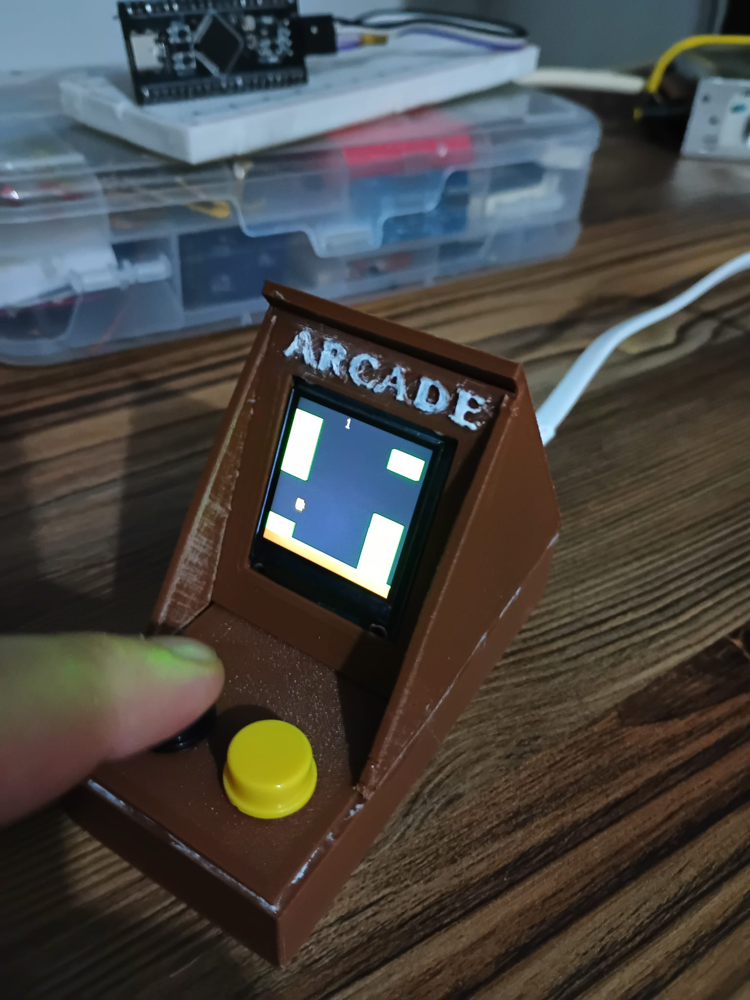
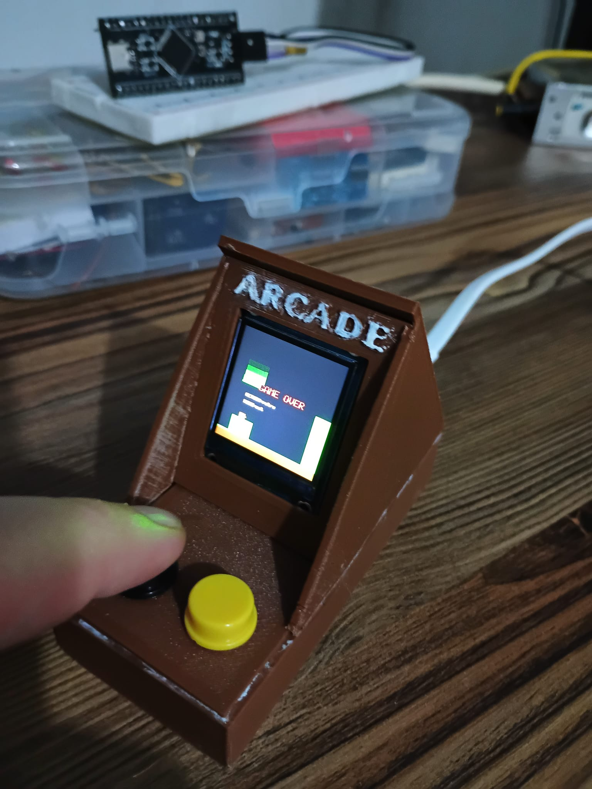
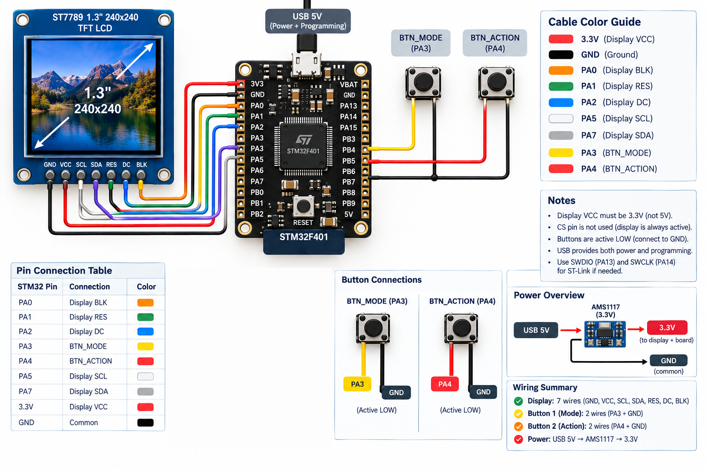

# Retro Arcade Clock

A small desktop clock with a retro CRT look, built on an STM32F401 and a 1.3" ST7789 display. It has three clock faces, a Flappy Bird game, and a time-set screen — all controlled with just two buttons.

---

## What it does

The device cycles through five screens:

**Digital → Analog → Retro → Flappy Bird → Time Set → (back to Digital)**

- **Digital** — big 7-segment display, 24-hour format
- **Analog** — classic round face with hour, minute and second hands
- **Retro** — colorful CRT-style layout with a white panel in the middle
- **Flappy Bird** — small game with pipes, score and game over screen
- **Time Set** — set the hour and minute directly on the clock

Pressing **MODE** moves to the next screen. Holding it for a second turns off the backlight (sleep). Pressing any button wakes it up again — the screen keeps showing whatever was there before, so nothing gets redrawn.

After 10 seconds without any button press, the backlight turns off on its own to save power.

### Screens

| Digital | Analog | Retro |
|---|---|---|
|  |  |  |

| Analog (2) | Time Set | Flappy |
|---|---|---|
|  |  |  |

| Game Over |
|---|
|  |

---

## Controls

Only two buttons are used, so their function depends on which screen you're on.

| Screen | MODE (short) | MODE (hold 1s) | ACTION |
|---|---|---|---|
| Digital | → Analog | Sleep | — |
| Analog | → Retro | Sleep | — |
| Retro | → Flappy | Sleep | — |
| Flappy (playing) | → Time Set | Sleep | Jump |
| Flappy (game over) | → Time Set | Sleep | Restart |
| Time Set | Next field / save | Sleep | +1 |
| Sleeping | Wake up | — | — |

On the Time Set screen, MODE switches between HOUR and MINUTE. A third press saves the value and returns to the digital clock. ACTION adds 1 to the selected field. The selected field blinks so you know which one you're editing.

---

## Hardware

| Part | Notes |
|---|---|
| STM32F401 | Black Pill or custom board |
| ST7789 1.3" 240×240 IPS | 7-pin SPI version (no CS pin) |
| 2× tactile buttons | 6×6 mm |
| USB 5V → 3.3V | AMS1117 regulator |

### Wiring

| STM32 | Connects to |
|---|---|
| PA0 | Display BLK (backlight) |
| PA1 | Display RES |
| PA2 | Display DC |
| PA3 | Button 1 → GND |
| PA4 | Button 2 → GND |
| PA5 | Display SCL |
| PA7 | Display SDA |
| 3.3V | Display VCC |
| GND | Common ground |

⚠️ The display runs at 3.3V. Do not feed it 5V — it will damage the panel.

Both buttons use the internal pull-ups, so no external resistors are needed. Pressing a button just pulls the pin to ground.

---

## How it works

The code is split into two main files:

- `st7789.c` — display driver: SPI communication, window setting, `FillRect`, `DrawLine`, `DrawCircle`, the 5×7 font, and string drawing
- `main.c` — everything else: state machine, screen renderers, button handling, and the Flappy game loop

A few things that were done to make it fast enough on a small MCU:

- **Batched SPI writes** — `FillRect` sends 128 pixels per call instead of one at a time
- **Partial redraws** — only the parts of the screen that changed get redrawn (e.g. just the second digit, not the whole clock)
- **Incremental pipe scrolling** — Flappy Bird pipes only repaint the 2-pixel edge that moved, not the whole pipe
- **Blink in place** — on the time-set screen, only the selected field is repainted, so the rest doesn't flicker

The clock is software-only — there's no RTC module. On power-up it starts at 10:08:30, and you set the real time from the Time Set screen.

---

## Project layout
Core/
 Inc/
  main.h
  st7789.h
 Src/
  main.c
  st7789.c

Drivers/ # STM32 HAL
schema/ # Wiring diagrams
screenshots/ # UI screenshots

---

## Building (or you can use the bin file directly!)

1. Open the project in STM32CubeIDE
2. Connect ST-Link (SWDIO → PA13, SWCLK → PA14)
3. Build All
4. Flash to the board
5. Unplug ST-Link and power the board over USB

---

## Enclosure

The case is 3D printed to look like a miniature CRT monitor — rounded bezel, small stand, two buttons on the front, USB cable exiting from the back. STL files coming soon.

---

## Notes

- Display is powered from 3.3V, logic from the STM32 (also 3.3V)
- Font is ASCII only — no Turkish characters
- No RTC, no battery backup — the time resets on power loss
- Flappy Bird's fall speed is halved compared to the rise, which makes the game playable with a single button

---

## License

MIT
